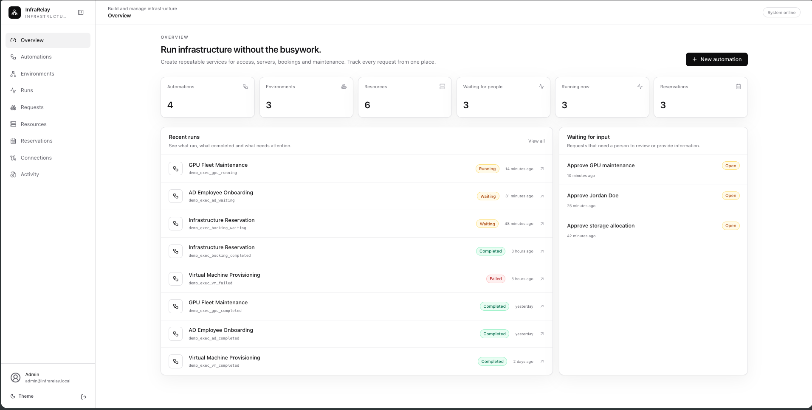
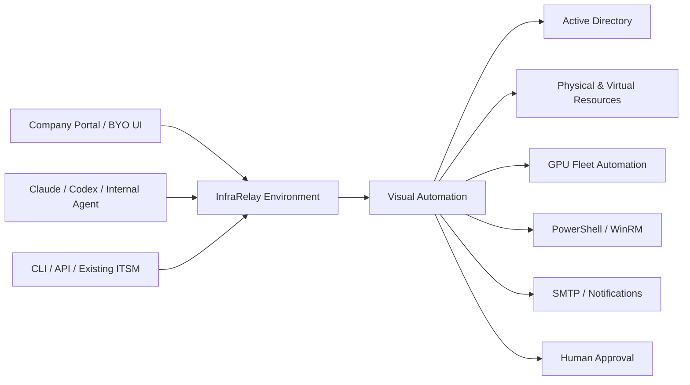
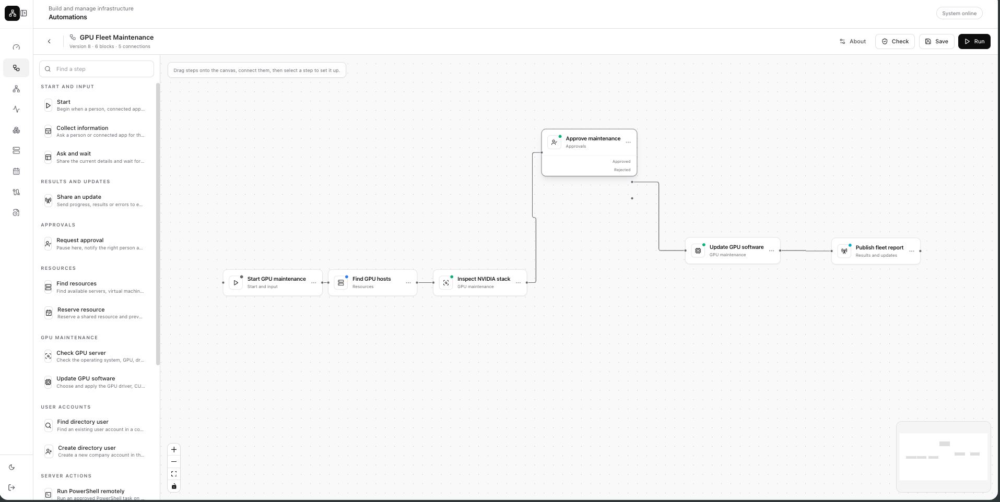
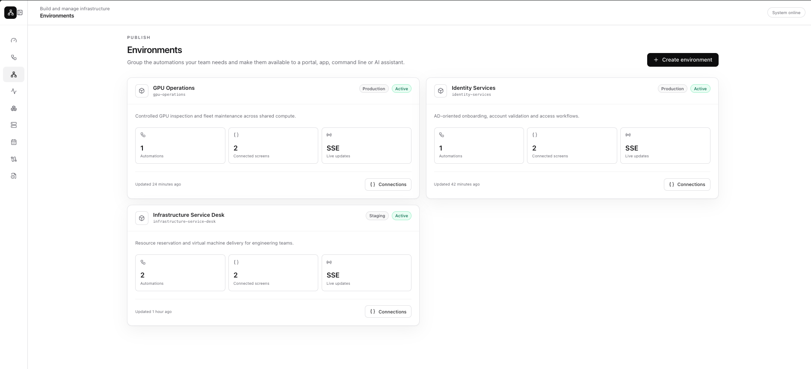
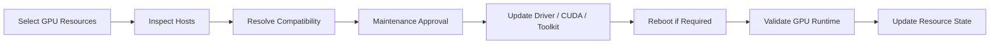

# InfraRelay

**Composable infrastructure operations for identity, resources, approvals and automated maintenance.**

InfraRelay turns infrastructure operations into reusable visual automations that can be deployed as controlled environments and connected to any interface, agent or internal platform.

It is designed for organisations that already depend on Active Directory, shared infrastructure, approval chains and operational validation—but still manage those processes through tickets, scripts, spreadsheets and one-off portals.



---

## The problem

Enterprise infrastructure is rarely greenfield.

Identity is usually anchored in Active Directory or a Microsoft hybrid identity model. Microsoft technical literature has historically cited Active Directory usage across **95% of enterprises**, while Microsoft currently reports more than **720,000 organisations** using Microsoft Entra ID. In practice, this means most infrastructure actions are not simply technical API calls—they are identity-aware transactions that must be validated against users, groups, organisational units, roles, permissions and approval policy.

A request to create a server may require:

- verification of the requester in Active Directory;
- confirmation of team, department or cost centre;
- manager or infrastructure approval;
- allocation of an available physical or virtual resource;
- provisioning through PowerShell, WinRM, SSH, Ansible or an infrastructure API;
- notification through the company SMTP relay;
- complete audit history for every decision and system change.

Most organisations solve these steps independently. A service desk ticket starts the request. A script performs one action. A spreadsheet tracks ownership. A separate portal handles bookings. Another tool manages GPU drivers. Human approvals live in email. The result is operational fragmentation, duplicated logic and infrastructure workflows that are difficult to reuse safely.

InfraRelay addresses this by treating **identity validation, infrastructure resources, automation blocks, human decisions and external interfaces as parts of the same execution model**.

---

## What InfraRelay is

InfraRelay is an infrastructure automation and human-in-the-loop orchestration platform.

Teams visually compose blocks for Active Directory, resource management, GPU maintenance, PowerShell, APIs, email, approvals and data handling. A completed automation can then be deployed inside an **Environment**—an isolated operational boundary that exposes its own inputs, outputs, event stream, permissions and connected tools.

InfraRelay does not own the customer application. It provides the execution fabric.



---

## Core operating model

### Automations

Automations are visual graphs made from reusable infrastructure blocks. Each block owns its configuration, inputs, outputs, validation and execution behaviour.

Examples include:

- Find an Active Directory user
- Create a directory user
- Run PowerShell remotely
- Search available resources
- Reserve a server or VM
- Inspect a GPU host
- Update NVIDIA drivers and CUDA
- Request human approval
- Send an SMTP notification
- Call an external API
- Publish a UI payload



### Environments

An Environment is a deployed operational boundary containing one or more automations.

It can represent:

- employee onboarding;
- infrastructure service delivery;
- GPU operations;
- training or lab allocation;
- controlled production maintenance;
- customer-specific automation services.

An Environment can be attached to a custom frontend, internal portal, command-line client or AI agent without changing the underlying automation.



### Resources

Resources are persistent infrastructure objects rather than temporary workflow data.

A resource can be a:

- physical server;
- GPU host;
- virtual machine;
- hypervisor;
- Kubernetes namespace;
- storage allocation;
- network appliance;
- lab machine;
- software entitlement;
- customer-defined infrastructure type.

Each resource type can define its own required fields and reservation policy. Teams can model GPU count, memory, operating system, hostname, IP address, serial number, hypervisor, cluster, storage capacity or any custom attribute without modifying frontend code.


### Requests and human-in-the-loop execution

A workflow can pause at any inbound, bidirectional or approval block.

The execution state is persisted while InfraRelay waits for a person, connected frontend or authorised agent. When a response is submitted, the exact workflow continues from the paused block.

This makes approvals native to the runtime rather than an external workaround.

---

## Active Directory as the validation layer

InfraRelay is built around the operational reality that identity validation often begins with Active Directory.

AD-oriented blocks can be used to:

- confirm that a requester exists;
- validate usernames and UPNs;
- resolve groups and organisational units;
- create controlled user accounts;
- route approvals using directory attributes;
- attach access policy to resource requests;
- maintain an audit trail around privileged actions;
- connect directory identity to infrastructure ownership.

This allows an infrastructure workflow to answer both questions that matter:

1. **Can the platform perform the technical action?**
2. **Is this user authorised to request or approve it?**

The result is safer self-service infrastructure without removing enterprise controls.

---

## GPU fleet automation

InfraRelay includes GPU provisioning capabilities adapted from the AutoDriver automation stack.

A GPU automation can:

- inspect operating system and GPU hardware;
- detect the currently installed NVIDIA driver;
- resolve a compatible target driver;
- install or update CUDA independently;
- install the NVIDIA Container Toolkit;
- resolve Nouveau conflicts;
- optionally enable IOMMU;
- coordinate reboot requirements;
- validate `nvidia-smi`, CUDA and container GPU access;
- update the resource inventory with the resulting state.

This workflow can be applied to one host, a selected set of resources or an entire GPU cluster. Combined with approvals and maintenance windows, it becomes a controlled fleet operation rather than an ad hoc server script.



---

## Bring Your Own UI

InfraRelay can operate headlessly.

UI payload blocks expose structured inbound, outbound or bidirectional transactions. A company can connect its own React application, internal service portal, mobile interface, CLI or ITSM workflow to those payloads.

The same automation can therefore be presented through different interfaces without duplicating backend logic.

**BYO UI allows teams to:**

- keep their existing design system;
- embed infrastructure services inside an internal portal;
- render forms from environment schemas;
- subscribe to live execution events;
- submit responses to paused workflows;
- build customer-specific experiences on top of the same automation.

InfraRelay includes a reference frontend, but the payload contract remains independent of it.

---

## Bring Your Own Key and agent attachments

An Environment can also be connected to a customer-controlled AI agent using BYOK.

Claude, Codex or an internal model can be attached with explicit scopes such as:

- read environment manifests;
- inspect UI payload schemas;
- generate a customer-owned frontend;
- review workflow state;
- submit permitted transaction responses;
- assist with automation design or testing.

The key remains customer-owned. Agent permissions are separate from infrastructure credentials, so a frontend-building agent does not automatically gain access to Active Directory passwords, SSH keys or production execution rights.

This makes agents an optional client of the platform—not the owner of the workflow.

---

## Why the architecture matters

InfraRelay separates the platform into clear concepts:

| Concept | Purpose |
|---|---|
| **Resource** | A persistent physical or virtual infrastructure object |
| **Resource Type** | The fields and reservation policy required for that class of resource |
| **Automation** | A visual graph of reusable operational blocks |
| **Environment** | A deployed boundary containing automations and interface contracts |
| **Request** | A structured input, approval or response required by a running automation |
| **Run** | One durable execution of an automation |
| **Connection** | A protected reference to AD, WinRM, SSH, SMTP or another external system |
| **Attachment** | A customer frontend, CLI or agent connected to an Environment |

This separation allows the same physical server to remain registered across many reservations and workflow runs, while the same automation can be reused by multiple interfaces or environments.

---

## Example use cases

### Employee onboarding

```text
Collect employee details
→ Validate requester in AD
→ Request manager approval
→ Create directory user
→ Assign approved access
→ Provision infrastructure
→ Publish completion payload
```

### GPU maintenance across a cluster

```text
Select GPU resources
→ Inspect current driver state
→ Resolve compatible versions
→ Approve maintenance window
→ Update NVIDIA stack
→ Reboot where required
→ Validate every host
→ Publish fleet report
```

### Infrastructure reservation

```text
Collect resource request
→ Validate requester identity
→ Find available infrastructure
→ Check booking conflicts
→ Request approval
→ Reserve resource
→ Notify requester
```

### Headless internal service

```text
Existing company portal
→ InfraRelay UI payload
→ Environment automation
→ Human or agent response
→ Infrastructure action
→ Live result stream
```

---

## Positioning

InfraRelay is not simply an automation canvas and it is not another fixed infrastructure portal.

It is a composable infrastructure operations layer for organisations that need:

- Active Directory-aware validation;
- reusable infrastructure workflows;
- human approval without losing execution state;
- physical and virtual resource booking;
- GPU fleet maintenance;
- customer-owned interfaces;
- customer-owned AI integrations;
- a complete audit trail around every action.

The platform provides a practical path from scripts and tickets to controlled infrastructure-as-a-service—without forcing organisations to replace the identity, UI, agent or operational systems they already trust.

---

## Screenshot files

Place the following light-mode screenshots in `docs/screenshots/`:

```text
dashboard.png
workflow.png
environment.png
resources.png
```

---

## Source note

The enterprise adoption statement above is based on Microsoft technical literature that cited Active Directory usage across 95% of enterprises. Microsoft’s current Entra ID product page separately reports adoption by more than 720,000 organisations.
