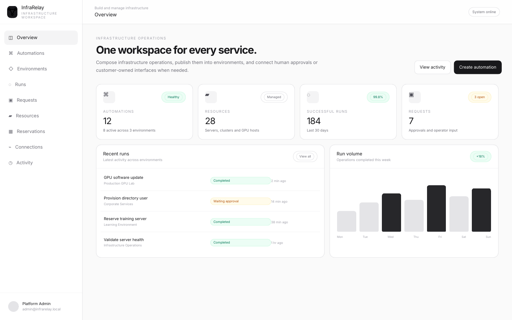
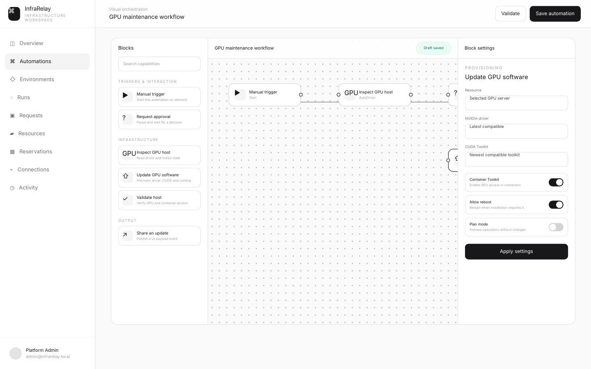
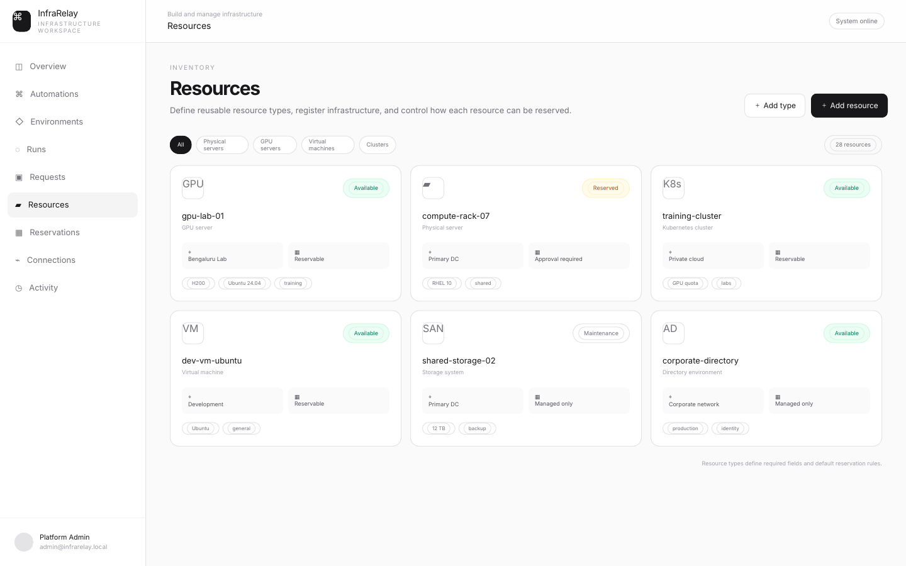

<div align="center">

# InfraRelay

### Infrastructure workflows, environments and human approval — in one visual workspace.

InfraRelay helps teams turn infrastructure operations into reusable services without forcing a specific frontend, cloud or AI provider.

</div>

---

## Product overview



InfraRelay combines a visual automation canvas, durable execution, infrastructure resources and human-in-the-loop requests. Teams can build internal services for directory operations, server reservations, GPU maintenance, remote PowerShell and wider infrastructure workflows.

## Visual automation



Each block owns its settings, inputs and outputs. Automations can pause for approval, interact with physical or virtual resources, and publish UI payloads that connect to a customer-owned frontend, CLI or agent.

## Resource operations



Resources are persistent infrastructure objects. Teams define their own resource types, required fields and reservation rules, then use those resources inside environment-scoped automations.

## Core model

```text
Resource types and connections
            ↓
     Visual automations
            ↓
        Environments
            ↓
Runs · Requests · Reservations · Activity
```

## Platform capabilities

- Visual infrastructure automation
- Environment-scoped workflows
- Human approvals and operator input
- Physical and virtual resource inventory
- Configurable resource types and reservation policies
- Active Directory and PowerShell operations
- NVIDIA driver, CUDA and container toolkit provisioning
- Customer-owned UI and agent integrations through payload contracts
- Durable runs, audit history and encrypted connection references

---

<div align="center">

**InfraRelay is the execution and integration layer. The customer retains ownership of the workflow, interface, infrastructure and credentials.**

</div>
